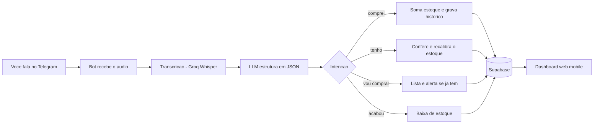
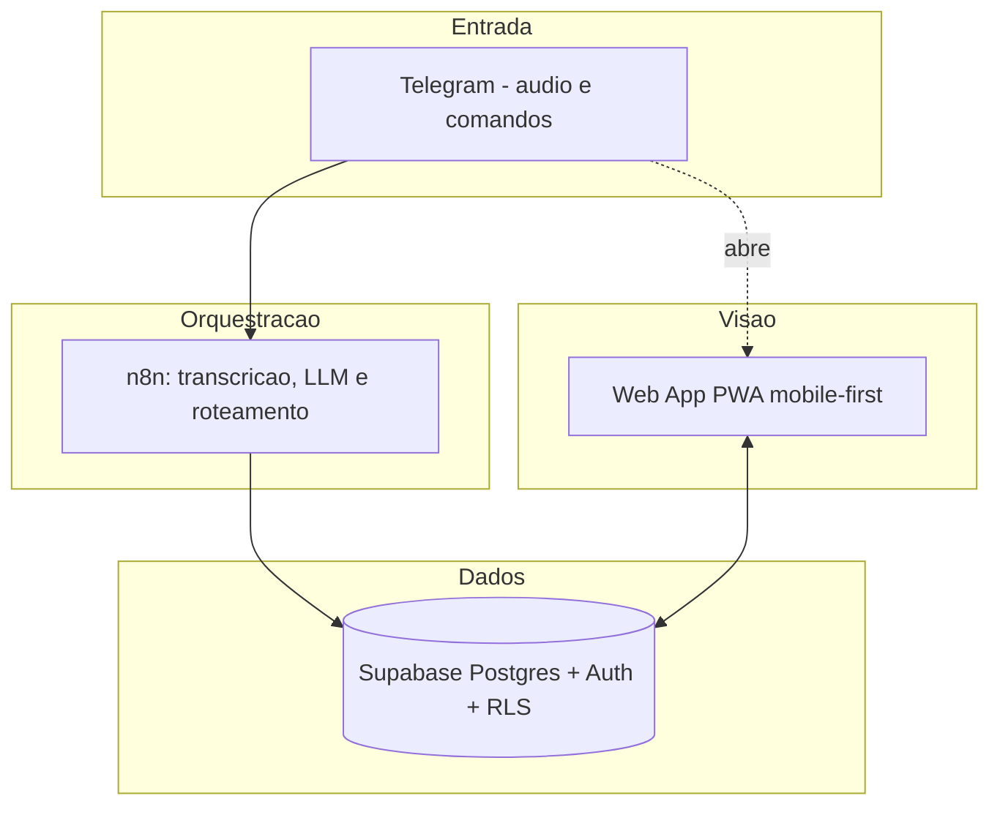

<div align="center">

# Mercado Mensal

### Controle a dispensa e as compras da sua casa falando. Só isso.

Mande um áudio no Telegram dizendo o que comprou ou o que já tem em casa.
O resto (estoque, lista, gastos e economia) o app monta sozinho.


</div>

---

## O problema

Todo mês a mesma cena: você não sabe o que ainda tem na dispensa, compra o que já tinha, esquece o que faltava, e no fim não faz ideia de quanto gastou nem se economizou. Planilha ninguém mantém. App de digitar item por item é chato demais para durar uma semana.

## A ideia

Falar é a interface. Você chega do mercado e fala. Você abre a dispensa e fala. O aplicativo entende, calcula e organiza. Nada de formulário.

> Você (áudio): *"comprei arroz cinco reais, dois pacotes, e café doze e noventa, um"*
>
> Bot: *arroz: estoque 2 · café: estoque 1, economizou R$0,60*

---

## Como funciona



O usuário fala em linguagem natural. O sistema transcreve, interpreta a intenção e atualiza o banco. O painel web mostra tudo de forma visual, no celular.

---

## Funcionalidades

| Recurso | O que faz |
| --- | --- |
| Registro por voz | "comprei", "tenho", "vou comprar", "acabou" viram ações automáticas |
| Estoque inteligente | Sabe o que tem em casa e estima o consumo do mês |
| Alerta anti-desperdício | Avisa quando você vai comprar algo que já tem de sobra |
| Conferência por voz | Ao falar o que tem na dispensa, o estoque se corrige e aprende seu ritmo |
| Lista de compras | Monta a lista e mostra o total estimado a pagar |
| Economia | Compara preços com o histórico e acompanha o orçamento do mês |
| Multi-família | Cada família tem sua dispensa. Convide pessoas por um código |
| Sem loja de app | É web, mobile-first. Abre pelo navegador ou pelo próprio Telegram |

---

## Demonstração

> Espaço reservado para prints e GIF do app. O painel é mobile-first, com tema claro e escuro.

<div align="center">

<!-- Adicione aqui: docs/estoque.png · docs/lista.png · docs/economia.png -->
`Estoque`  ·  `Lista de compras`  ·  `Economia`

</div>

---

## Arquitetura



- Toda a regra de negócio (somar, dar baixa, conferir, calcular economia) vive em funções SQL no Supabase, chamadas por RPC. O n8n fica magro.
- Isolamento por família garantido no banco via Row Level Security.

---

## Stack

- Entrada e automação: Telegram Bot + n8n
- Transcrição: Groq Whisper
- Interpretação: LLM com saída estruturada em JSON
- Banco e autenticação: Supabase (Postgres, Auth, RLS)
- Painel: Web App PWA, mobile-first

---

## Estrutura do repositório

```
supabase/
  migrations/
    0001_init.sql          Tabelas base (estoque, compras, lista, orcamento)
    0002_functions.sql     Regras de negocio como funcoes SQL (RPC)
    0003_multitenant.sql   Multi-familia, convite e RLS
README.md
```

O fluxo do bot é mantido no n8n. O painel web é desenvolvido à parte.

---

## Como usar

1. Crie sua conta no app (e-mail e senha).
2. Crie sua família ou entre em uma com o código de convite.
3. Abra o Telegram, fale com o bot e envie o código para conectar.
4. Comece a mandar áudios do que comprou ou do que já tem em casa.

---

## Roadmap

- [x] Banco de dados e regras de negócio (Supabase)
- [x] Fluxo de ingestão por voz (n8n)
- [ ] Dashboard web (estoque, lista, economia)
- [ ] Onboarding da primeira dispensa
- [ ] Job diário de baixa estimada de estoque
- [ ] Canal WhatsApp

---

<div align="center">

Feito para quem quer controlar o mercado do mês sem esforço.

</div>
